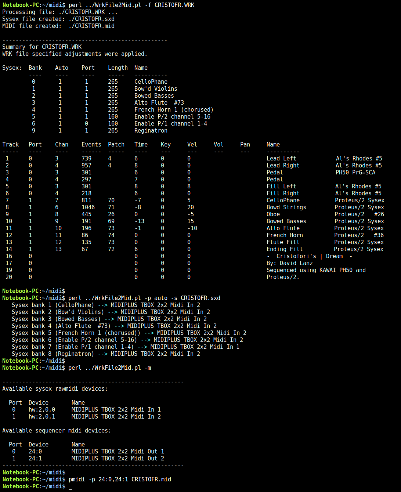
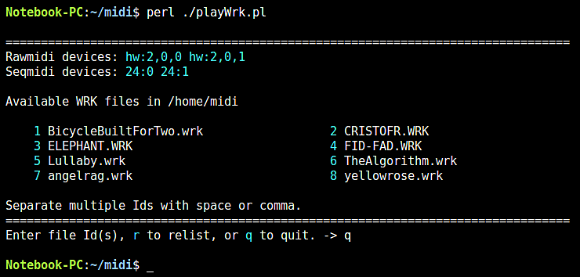

# WrkFile2Mid.pl
This CLI perl program parses and extracts data from Cakewalk WRK files. This file
type was used with early 90's versions of the Cakewalk MIDI Sequencer program 
marketed by Twelve Tone. Cakewalk MIDI sequencer WRK files hold sequencer related 
musical data (note, tempo, lyric, etc.), Cakewalk GUI settings, studio music 
device configurations, and MIDI device system exclusive (sysex) data. 
 
A Cakewalk feature of the sysex bank allows for marked sysex entries to be 
auto-sent to the MIDI devices during sequence load. This feature was used 
to initialize my pre-General Midi EMU Proteus units with the customized 
presets needed for each sequence. In this way, each WRK file sequence is 
standalone and does not rely on any previously used presets. A number of
options are provided for processing this sysex data.
     
The Cakewalk track/measure view provides user adjustment values. These
settings dynamically alter MIDI event data during playback. This adjustment
data, if used, is stored in the WRK file. Playback start adjustments include
pan, volume, and patch for each track. Dynamic adjustments during playback
included MIDI note transposition, note velocity, and time offset. These
adjustments are applied during MIDI output file creation unless the **-n** 
option (no adjust) is specified.
   
This program has been tested with Cakewalk WRK file versions 2.0, 3.0,
and 'new 4.0'. New 4.0 identifies as 3.0 but has additional record types.
The MIDI format 1 output file has been used with Audacity, Rosegarden, 
and CLI pmidi (linuxmint) players. 

**NOTE:** This WrkFile2Mid version requires the syxmidi tool. This executable
must be located with WrkFile2Mid. This tool is used to show the available ALSA 
MIDI ports and throttle the sysex data transmissions. See the syxmidi documentation.
   
In general, this CLI based program provides the following functions.
   
1. Create a standard MIDI file of the musical sequence. This includes all WRK 
file specified tracks unless limited by the **-t** option. A standard MIDI file 
`<file>.mid` is created from the input `<file>.wrk`.
         
2. Optionally ( **-a** ) include MIDI device sysex data that is WRK file marked 
as auto-send in track 0 of the MIDI file.  
         
3. Optionally ( **-f** ) create a formatted sysex data file for use with this 
program. WRK file specified auto-send, port, name, and raw sysex data are included.
The file `<file>.sxd` is created from the input `<file>.wrk`.
         
5. Optionally ( **-e** ) create an export file containing the raw sysex data.
This data can then be import/manipulated by an external program. The
file `<file>.syx` is created from the input `<file>.wrk`.
      
**NOTE:** New files silently overwrite any existing file of the same name.
   
## Support functions

### -s option
Process the specified sysex file; .sxd or .syx. This option uses optional user 
input that is specified by the **-p**, **-M** and **-z** options. Note that sysex 
data contains a manufacturer ID that must match the target MIDI device to be 
successfully utilized. Otherwise, the device will ignore the sysex transmission. 

Example sxd file created by the -f option.
```
auto:yes
port:1
name:Flute/Horn     P/2   #84
sysx:F018040001540046006C0075007400650068006F ... 001EF7
auto:no
port:1
name:Set P/2 all 'P'
sysx:F018040003000200000202787FF7F01804000300 ... 787FF7
auto:yes
port:0
name:Set P/1 all 'P'
sysx:F018040103000200000202787FF7F01804010300 ... 787FF7
auto:yes
port:0
name:Stereo Piano   P/1   #64
sysx:F0180401014000530074006500720065006F0020 ... 003CF7
```

### -p option
- When this option is **NOT** specified, the processing of the .sxd or .syx file 
occurs interactively with the user. The available MIDI device ports are displayed 
for user selection. The devices displayed can be limited or ordered using the **-M** 
option. The available sysex banks are then displayed for user selection and transmission.
          
- When this option value is numeric, the value represents the MIDI device port to use; 
e.g. 0, 1. The .sxd port value in each bank is ignored. All .sxd sysex banks 
marked `auto:yes` are transmitted.
          
- When this option value is **auto**, the .sxd specified port value in each sysex bank 
is used. All .sxd sysex banks marked `auto:yes` are transmitted. The **-M** option will 
likely be needed if more than one MIDI device is available.
          
### -M option
This option specifies one or more rawmidi port mappings. The first entry alters port 0, 
the second port 1, etc. Rawmidi ports are used by the -s option and correspond to the 
.sxd file Port column value. The value entered for each port must wholly or partially 
match the Device or Name shown by the -m (lowercase) option. Examples:
```
   Port  Device       Name
    0    hw:2,0,0     MIDIPLUS TBOX 2x2 Midi In 1
    1    hw:2,0,1     MIDIPLUS TBOX 2x2 Midi In 2

      -M 'hw:2,0,1'  - Port 0 set to specified device.
      -M '0,1'       - Port 0 set to matching device hw:2,0,1.

   Semicolon separates multiple port mappings.
          
      -M 'In 2;In 1' - Port 0 set to device with name containing In 2.
                     - Port 1 set to device with name containing In 1.
      -M '0,1;In 1'  - Port 0 set to matching device hw:2,0,1.
                     - Port 1 set to device with name containing In 1.
```          
### -z option
Specifies a microsecond time delay value; typically 0-500. It is used between bytes 
of the sysex data transmission associated with the **-s** option. This throttle helps 
to mitigate data overload with older MIDI devices. Default 250 if not specified.    
       
### -t option
Specifies the WRK file track(s) to process; multiple tracks must be comma separated. 
For example: -t 1,2,5 includes only tracks 1, 2, and 5 in the standard MIDI file.
          
### -n option
Disables use of WRK file specified track/measure adjustment values. When not disabled, 
MIDI control events are added and note event data is adjusted. Following WRK file to 
MIDI file conversion, a summary of the adjustments performed will be displayed.

### -N option
Disables the inclusion of track specified sysex data in the MIDI file. Depending on the
MIDI sequencer and equipment, lengthy sysex data transmissions during playback might 
result in MIDI data errors. This option is independent of the -a option functionality.
          
## Diagnostic Funtions
   
### -c option
Check the specified MIDI file by walking its header and track data structure. No other 
processing is performed.
### -m option
Show available MIDI devices. No other processing is performed.
### -u option
Show unhandled chunk Ids that are present in the WRK file.
### -v option
Display the WRK file chunk data after parsing. No other processing is performed.
### -x option
Displays a hex dump of the specified file. No other processing is performed.

## Usage summary
```
   WrkFile2Mid.pl  [-h] [-d <lvl>[m]] [-a] [-f] [-e <file>] [-s <file>.sxd] 
                   [-p <n>|auto] [-z <us>] [-M <map>] [-t <trk>[,<trk]] [-m]
                   [-c <file>] [-n] [-N] [-u] [-v] [-x <file>] [<path>/]<file>

   -h            Displays program usage text.
   -d <lvl>[m]   Run at specified debug level; 1-3. Higher number, more detail. 
                 Colored text is used for each level. Specify 'm' (e.g. 2m),
                 for monochrome text. Useful with redirected console output.

   -t <trk>      Process only the specified track(s).
   -a            Include sysex bank data in track 1 of MIDI file. 
   -f            Format sysex data to a -s useable .sxd file.
   -e            Export raw sysex data to a .syx file.
   
   -s <file>     Sysex data for transmission to a MIDI device.
   -p <p>|auto   MIDI device port. -s option interactive if not specified.
   -M <map>      Specifies a MIDI device port mapping string. 
   -z <usec>     Sysex throttle. Default 250 usec/byte.
    
   -c <file>     Check the specified file for valid MIDI format.
   -m            Show available MIDI devices.
   -n            Don't use WRK file track/measure adjustment values.
   -N            Don't use track specified sysex data.
   -u            Show WRK file unknown chunkIds.
   -v            Display extracted WRK file data and then exit.
   -x <file>     Dump specified file as hex bytes.             
```

## Examples
```
   WrkFile2Mid.pl mySequence.wrk
      Process the specified cakewalk WRK file located in the current working
      directory. The file mySequence.mid is created. Sysex bank data is
      ignored.

   WrkFile2Mid.pl -v mySequence.wrk
      Parse the specified cakewalk WRK file and display a summary of the
      data it contains. No output .mid file is created.

   WrkFile2Mid.pl -a ./cakewalk/sequences/*.wrk
      Process all WRK files found in the cakewalk/sequences folder below the 
      current working directory. All corresponding .mid files are created in
      the specified directory and include auto-send sysex data in track 1.

   WrkFile2Mid.pl -f mySequence.wrk
      Process the specified WRK file and create mySequence.sxd in the
      current working directory.

   WrkFile2Mid.pl -p auto -M 'In 2;In 1' -s mySequence.sxd
      Transmit the auto:yes marked sysex banks in the mySequence.sxd file
      to a MIDI device(s). Use the .sxd specified port in each bank as mapped
      to a corresponding physical MIDI device port.
```

<br/>
<br/>

# playWrk.pl
This program is a wrapper for WrlFile2Midi.pl. It provides an interactive
user interface for WRK file selection. The user selected file is processed
by WrkFile2Mid.pl to create sysex (.sxd) and MIDI (.mid) file output. The
.sxd sysex data is then sent to the currently available MIDI devices using
syxmidi. Playback of the .mid file is then initiated using the pmidi program.
Upon completion of playback, the user is prompted to select another WRK file.

The -e option specifies the location of WrkFile2Mid.pl and syxmidi if not in
the current working directory or playWrk.pl startup directory.

The -w option specifies the location of the WRK files if not in the current
working directory.

WRK files specified on the startup CLI suppress user interactive prompting
and may include a directory path. Linux piped input is also supported.

## Usage summary
```
   playWrk.pl  [-h] [-e <dir>] [-w <dir>] [[<path>/]<file>, ...]

   -h            Displays program usage text.
   -e <dir>      Specifies support tool directory.
   -w <dir>      Specifies WRK file directory.
```

## Examples
```
   playWrk.pl
      Interactive processing of WRK files in the current working directory.

   playWrk.pl -e /home/don/perl -w ./midi
      Interactive processing of WRK files located in the ./midi directory.
      Support tools are located in the /home/don/perl directory.

   playWrk.pl -e /home/don/perl ./midi/piano.wrk ./midi/ditty.wrk
      Non-interactive processing of the specified WRK files. Support tools
      are located in the /home/don/perl directory.
```

<br/>
