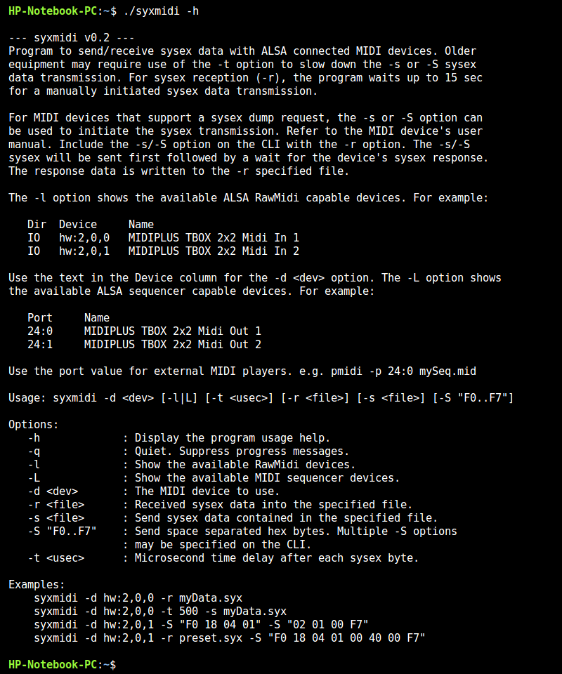

# Syxmidi
Syxmidi is a small CLI based program that transmits and received system exclusive 
(sysex) data between a computer and MIDI device. The primary feature of syxmidi is 
the ability to insert a user specified time delay in the sysex byte transmissions. 
This effectively throttles the data rate for computer to MIDI device sysex transfers.
Throttle rates are typically in the range of 0 to 500 microseconds per byte. 

Older MIDI devices may require a slower transmission rate due to their inability
to keep pace with modern computer data rates. Though MIDI devices all comply with the
MIDI standardized 31.25 Kbps baud rate, older devices may not process the received 
data fast enough to keep pace with longer sysex messages. This overload results in 
dropped sysex data and MIDI messaging errors. The user specified delay value
slows the byte rate, not the MIDI 31.25 Kbps baud rate, resulting in more time for
the MIDI device to process previously received data bytes.

For reference, using Emu Proteus 1 and 2 devices and a USB MIDI connection, a 200 
microsecond delay value is needed for successful transmission of the 'User Presets' 
17K bytes. 

Syxmidi uses the ALSA Library API for MIDI device communication; specifically
the RawMidi interface. This interface bypasses API functions for MIDI event 
processing and data buffering. This allows syxmidi to control the transmission 
byte rate. 

The sysex data to be sent can be specified as a file or on the CLI similar to
the amidi program that is part of the ALSA library. A syxmidi receive function
is also provided to facilitate MIDI device sysex dump requests. That is; a
small sysex message to the MIDI device requesting specific data followed by 
the MIDI device's data response back to syxmidi. CLI options for showing and
selecting from the available ALSA MIDI devices are also provided.

This is a C language program with some source code leveraged from amidi.c and 
pmidi.c. Refer to the syxmidi.c program header for the build command. The 
archive zipped executable was built on Linux Mint 22.3 Zena. The code was also
successfully compiled and tested on Raspberry Pi4 linux 10 (buster).

Use `syxmidi -h` to display the program usage text.

**syxmidi_v0.2.zip** - Linux mint compiled executable. 
`md5: b6ccea14c0068d36d0a7ce87b30e0a50` 

 
